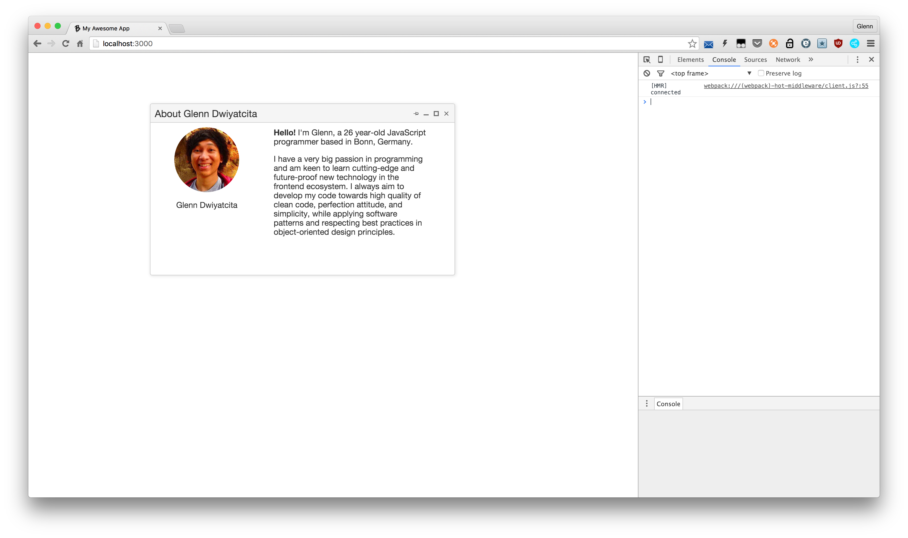

# my-frontend-react-boilerplate
My interpretation of how a boilerplate with a minimum set of tools 
should look like for my frontend application development. Extended from 
[my base frontend boilerplate](https://github.com/dwiyatci/my-frontend-boilerplate), 
equipped with ReactJS and a custom Node.js-based dev-server. 
Batteries included! :neckbeard: :sparkles: 



### Why?
Because I start to keep repeating over and over again scaffolding my 
project structure, especially when constructing my favorite 
`webpack.config.js`, `webpack.prod.config.js`, and `package.json` files. 

Note that the Webpack configuration should be easily extensible to pack 
popular modern JS frameworks like **React** or **Angular 2**. It might as 
well be flexible to switch from the [webpack-dev-server](http://webpack.github.io/docs/webpack-dev-server.html) 
to more customized Node.js [Express](http://expressjs.com/) server, 
which uses the [webpack-dev-middleware](http://webpack.github.io/docs/webpack-dev-middleware.html).

Molly's automation principle:
> Do it once, just do it. Do it twice, take notes. Do it three times, automate. :raising_hand:

## What's on the Stack
* JavaScript ES6/7 (Babel)
* React
* Bootstrap 4 (and Font Awesome)
* lodash
* jQuery
* Kendo UI Core (err, [why is still version 1.0.2 in npmjs](https://www.npmjs.com/package/kendo-ui-core)? Anyone?) :pensive:
* Webpack
* Node.js + Express for the development server

## Installation
* Install Node.js and npm from its [website](https://nodejs.org), or better even, use [nvm](https://github.com/creationix/nvm).

* Checkout the repo, `cd` to project directory, and setup dependencies:
```bash
$ [sudo] npm run setup
$ npm run install:clean
```

* For development, start Webpack development server with hot reloading capability:
```bash
$ npm run start
```
You'll find the app running on http://localhost:3000/.

* For production, build frontend static assets:
```bash
$ npm run build
```
Then, simply drop all files under `dist` directory to the production server.

## Author
Glenn Dwiyatcita ([@dwiyatci](http://tiny.cc/dwiyatci))

## License
WTFPL – Do What the Fuck You Want to Public License.

See [LICENSE.txt](LICENSE.txt). 


